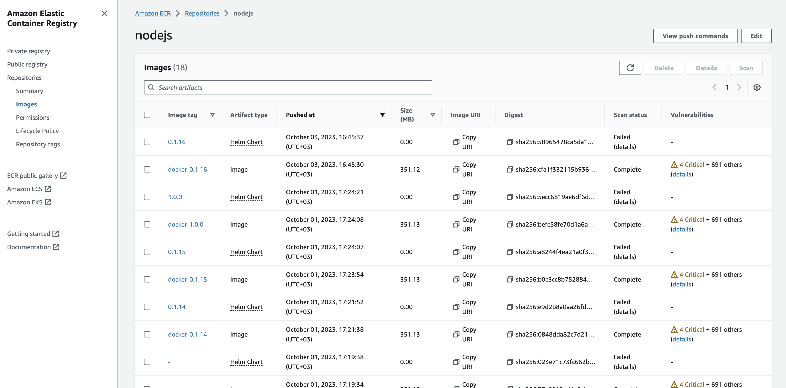
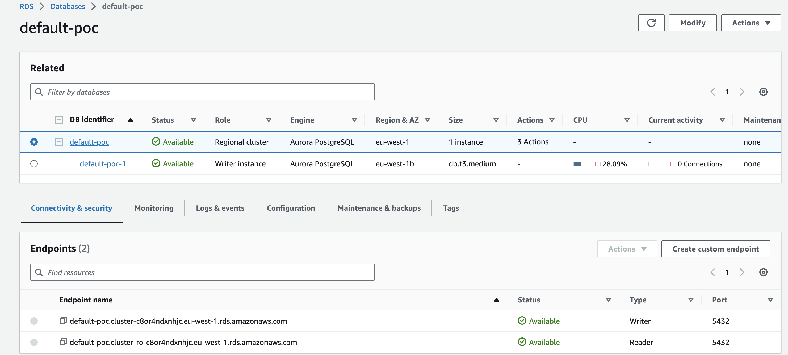
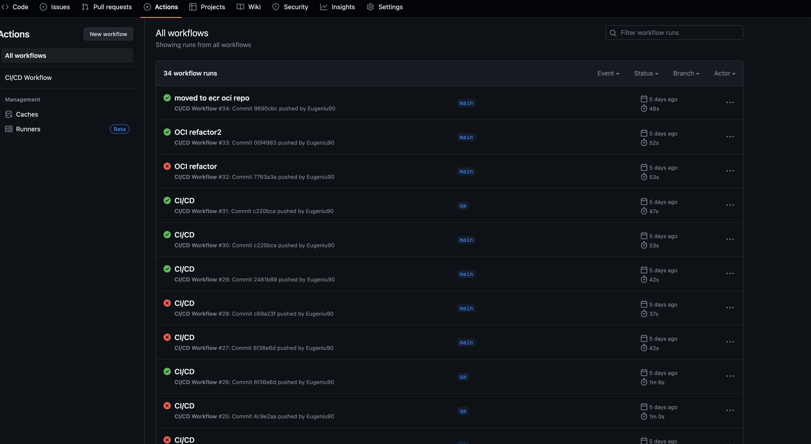

# Node JS

## Overview

"Node JS" is a simple Node.js application with a RESTful API. This project demonstrates a CI/CD pipeline using GitHub Actions, containerization using Docker, and infrastructure provisioning using Terraform.

## Setup Locally

### Prerequisites

- Node.js (v14 or later)
- Docker
- AWS CLI (configured with appropriate credentials)

### Instructions

1. Clone the repository:
```shell
   git clone https://github.com/Eugeniu90/nodejs.git 
```

2. Navigate into terraform directory and apply TF code:
```shell
tfa -var-file=env/dev.tfvars
```
This will create for us following main resources:
- EKS cluster
- Aurora cluster - PostgreSQL with 12.8 version
- Security Groups
- VPC that will have entire network defined
- ECR that will be responsible for Dockerfiles and Helm charts

3. Output after TF apply finished:
```shell
Apply complete! Resources: 4 added, 0 changed, 0 destroyed.

Outputs:

cluster_endpoint = "https://E4C2E282F9283C0DD18A67B0175AC1C6.gr7.eu-west-1.eks.amazonaws.com"
cluster_id = "poc-eks-cluster"
cluster_name = "poc-eks-cluster"
cluster_security_group_id = "sg-01234456"
config_map_aws_auth = [
  {
    "binary_data" = tomap({})
    "data" = tomap({
      "mapAccounts" = <<-EOT
      []

      EOT
      "mapRoles" = <<-EOT
      - "groups":
        - "system:bootstrappers"
        - "system:nodes"
        "rolearn": "arn:aws:iam::1234556789:role/poc-eks-cluster20230928125835414100000001"
        "username": "system:node:{{EC2PrivateDNSName}}"

      EOT
      "mapUsers" = <<-EOT
      []

      EOT
    })
    "id" = "kube-system/aws-auth"
    "immutable" = false
    "metadata" = tolist([
      {
        "annotations" = tomap({})
        "generate_name" = ""
        "generation" = 0
        "labels" = tomap({
          "app.kubernetes.io/managed-by" = "Terraform"
          "terraform.io/module" = "terraform-aws-modules.eks.aws"
        })
        "name" = "aws-auth"
        "namespace" = "kube-system"
        "resource_version" = "796"
        "uid" = "d5bf9609-5e79-45b2-aec9-e075d0548986"
      },
    ])
  },
]
kubectl_config = <<EOT
apiVersion: v1
preferences: {}
kind: Config

clusters:
- cluster:
    server: https://URL
    certificate-authority-data: CERT
  name: eks_poc-eks-cluster

contexts:
- context:
    cluster: eks_poc-eks-cluster
    user: eks_poc-eks-cluster
  name: eks_poc-eks-cluster

current-context: eks_poc-eks-cluster

users:
- name: eks_poc-eks-cluster
  user:
    exec:
      apiVersion: client.authentication.k8s.io/v1alpha1
      command: aws-iam-authenticator
      args:
        - "token"
        - "-i"
        - "poc-eks-cluster"

EOT
region = "eu-west-1"
```
4. Once we have created our infrastructure, we can start to build our Dockerfile and push images directly into ECR.
```dockerfile
FROM node:14

# Set the working directory
WORKDIR /usr/src/app

# Copy package.json and package-lock.json
COPY package*.json ./

# Install dependencies
RUN npm install

# Copy the rest of the application code
COPY . .

# Expose the port
EXPOSE 3000

# Command to run the application
CMD ["node", "app.js"]
```

Image is pretty easy to read - it's using NPM 14 and once we copied package.json, we are installing dependencies and run application when deployment invoke it.

5. Release management strategy:
   - We will have 3 branches: [`main, qa ,rc`] which are our 3 environments and we have the following tagging in place for helm, branch and images.
   - `main`: will always have `latest` as tag.
   - `qa`: tagging started from 0.1.0 and during each commit push into `qa` branch, we will have a new build triggered by GitHub actions which will increase the tag, update Helm chart version and increase Dockerfile image. 
   - `rc`tagging started from 1.0.0 and during each commit push into `rc` branch, we will have a new build triggered by GitHub actions which will increase the tag, update Helm chart version and increase Dockerfile image.

Example of tags created after each build:
```shell
git tag
0.1.0
0.1.1
0.1.10
0.1.11
0.1.12
0.1.13
0.1.15
0.1.16
0.1.2
0.1.3
0.1.4
0.1.5
0.1.6
0.1.7
0.1.8
0.1.9
1.0.0
latest
```

ECR registry after testing:



RDS database:


GitHub actions evidence:



6. Configure as well the details for Database in `app.js` file:
```json
const dbConfig = {
  user: 'your-db-username', // Replace with your database username
  host: 'your-db-host', // Replace with your RDS endpoint
  database: 'your-db-name', // Replace with your database name
  password: 'your-db-password', // Replace with your database password
  port: 5432 // Replace with your database port
};
```

7. Once we have all details in place, with new push to Dockerfile we will have application responding to us.
8. Tunnel into application for seeing that is working as expected with the following command:
```shell
(ansible-venv) ➜  terraform git:(main) kubectl port-forward svc/app-nodejs -n dev 7001:80             
Forwarding from 127.0.0.1:7001 -> 3000
Forwarding from [::1]:7001 -> 3000
```

8.1 Response from aplpication:
```shell
(ansible-venv) ➜  nodejs git:(main) ✗ curl http://localhost:80
<html><body><h1>It works!</h1></body></html>

(ansible-venv) ➜  nodejs git:(main) ✗ curl http://localhost:80 -I 
HTTP/1.1 200 OK
Date: Wed, 04 Oct 2023 14:20:24 GMT
Server: Apache/2.4.56 (Unix)
Content-Location: index.html.en
Vary: negotiate
TCN: choice
Last-Modified: Sat, 16 Sep 2023 13:28:30 GMT
ETag: "2d-60579e287db80"
Accept-Ranges: bytes
Content-Length: 45
Content-Type: text/html
```

8.2 Post example:
```shell
curl -X POST http://localhost:7001/data -H "Content-Type: application/json" -d '{"name": "John Doe", "age": 30}'
```

Output:
```shell
{"status":"Data received"}%
```
